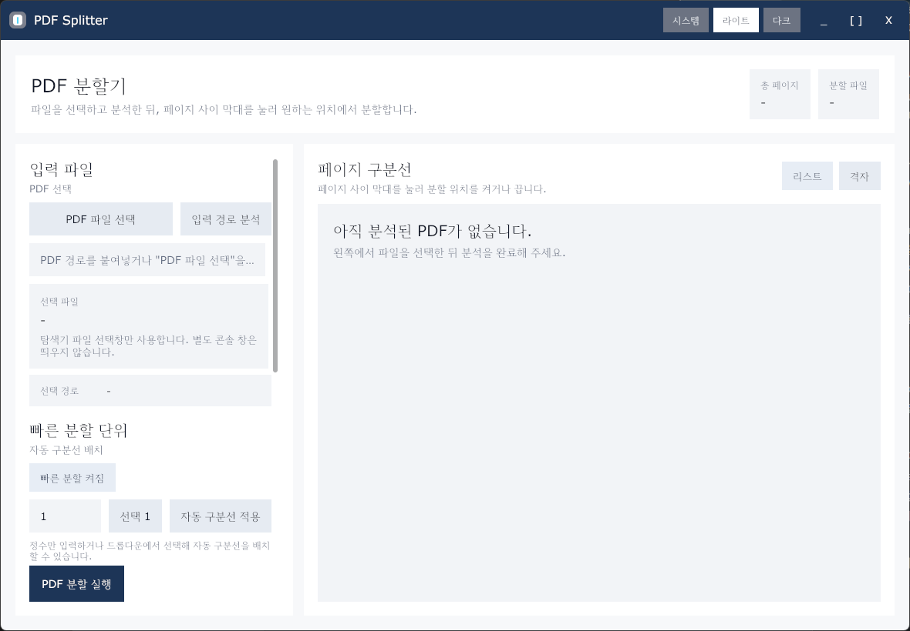
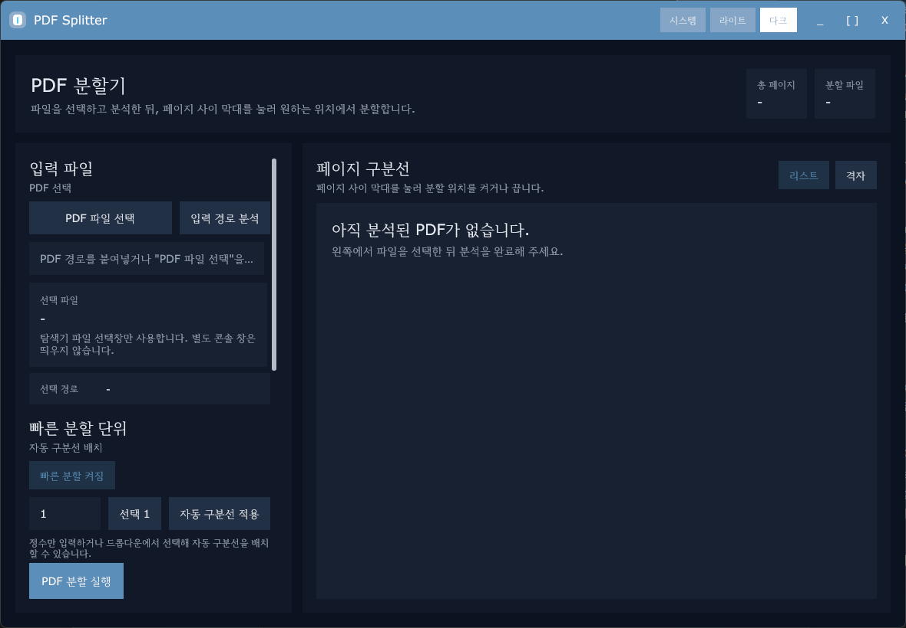

# PDF Splitter

<p align="center">
  
</p>

<p align="center">
  
  
  
  
  
</p>

<p align="center">
  실제 PDF 페이지 썸네일을 보면서 원하는 위치를 직접 나누는 Windows 우선 GUI PDF 분할기입니다.
</p>

## 화면 예시

| 라이트 모드 | 다크 모드 |
| --- | --- |
|  |  |

## 개요

- 실제 페이지 썸네일 기반 분할
- 리스트형 / 격자형 보기 전환
- 페이지 클릭 확대 보기
- 빠른 분할 단위 토글 및 숫자 입력
- 원본 폴더 차번 파일명 저장
- 분할 완료 후 저장 위치 바로 열기
- 시스템 / 라이트 / 다크 테마 지원
- 커스텀 타이틀바 및 앱 아이콘 적용

## 현재 상태

- 현재 공개 릴리즈와 검증 기준은 Windows입니다.
- macOS는 코드베이스와 빌드 스크립트만 준비된 상태입니다.
- macOS 실기기 빌드, 실행 검증, 배포 패키징은 아직 완료되지 않았습니다.
- 맥북에서 이어서 작업할 때는 [MACOS_SETUP.md](MACOS_SETUP.md)를 기준으로 준비하면 됩니다.

## 주요 특징

### 1. 직접 보고 나누는 분할 UX

- PDF를 분석하면 페이지 썸네일이 생성됩니다.
- 페이지 사이 구분선을 클릭해 분할 위치를 직접 지정할 수 있습니다.
- 페이지를 누르면 같은 화면 안에서 확대 미리보기를 볼 수 있습니다.

### 2. 빠른 작업 흐름

- `PDF 파일 선택` 또는 경로 직접 입력 지원
- 빠른 분할 단위 토글 지원
- 숫자 입력과 추천 단위 드롭다운으로 자동 구분선 배치
- 분할 후 저장 위치를 바로 탐색기에서 열 수 있습니다.

### 3. 보안 하드닝

- 입력 경로 정규화 및 절대경로 확인
- `.pdf` 확장자, 실제 파일, 빈 파일 여부 확인
- PDF 헤더 `%PDF-` 시그니처 확인
- 파일 크기 상한: `256MB`
- 페이지 수 상한: `2000페이지`
- `pdfcpu` 유효성 검사
- 암호화 PDF 차단
- 첨부파일 포함 PDF 차단
- `OpenAction`, `AA`, `JavaScript`, `Launch`, `SubmitForm`, `ImportData`, `GoToR`, `GoToE`, `XFA`, `RichMedia` 등 위험 기능 차단
- 분할 저장 시 임시 파일 후 확정 방식 적용
- 썸네일 렌더링 타임아웃 및 Java 힙 상한 적용
- 썸네일 캐시 자동 정리

## 기술 스택

- Go 1.26+
- Gio
- pdfcpu
- Apache PDFBox 3.0.7

## 실행 방법

### 로컬 실행

```powershell
go run ./cmd/pdfsplitter
```

### Windows 빌드

```powershell
./scripts/build.ps1
```

생성 파일:

- `dist/windows/pdf-splitter.exe`
- `pdfsplitter.exe`

### macOS 빌드 참고

```bash
chmod +x ./scripts/build-macos.sh
./scripts/build-macos.sh
```

참고:

- `dist/macos/pdf-splitter`
- 아직 실기기 검증과 배포 패키징은 완료되지 않았습니다.

## 릴리즈 패키징

```powershell
./scripts/release.ps1
```

생성 파일:

- `dist/release/v0.1.0/pdf-splitter-v0.1.0-windows-x64.zip`
- `dist/release/v0.1.0/SHA256SUMS.txt`
- `dist/release/v0.1.0/RELEASE_NOTES.md`

## 프로젝트 구조

```text
cmd/pdfsplitter      앱 진입점
internal/pdf         PDF 분석, 분할, 썸네일, 보안 정책
internal/platform    OS별 파일 선택, 폴더 열기, 테마 감지
internal/ui          GUI 화면과 사용자 상호작용
scripts              빌드, 릴리즈, 보안 점검 스크립트
tools/pdfbox         썸네일 렌더러 자산
assets               아이콘 및 README 자산
```

## 오픈소스

- 이 프로젝트는 [Apache License 2.0](LICENSE)으로 공개됩니다.
- 사용, 수정, 재배포, 상업적 이용이 가능합니다.
- 써드파티 고지는 [THIRD_PARTY_NOTICES.md](THIRD_PARTY_NOTICES.md)에 정리했습니다.

## 점검

```powershell
./scripts/security-check.ps1
```

`govulncheck`가 설치되어 있으면 같이 실행되고, 없으면 빌드/테스트와 PDFBox 자산 확인까지만 수행합니다.
